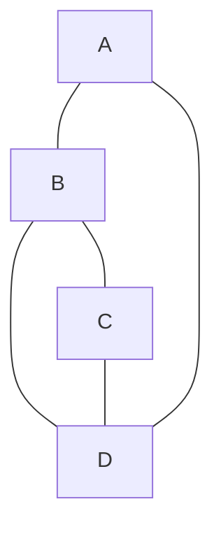
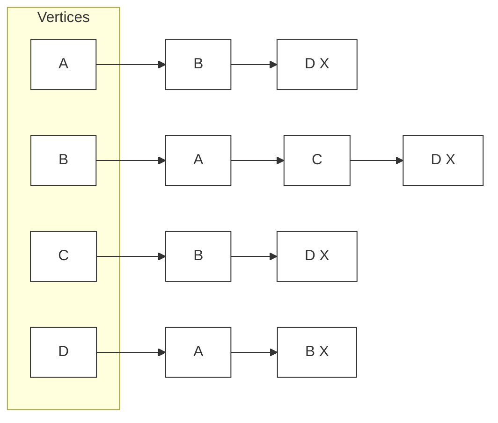

# Graphs Using Adjacency Lists
- insertNode(t value): checks if the value already exists, creates a new node if not, stores the Node in the nodes map
- nodeCount(): returns the total number of Nodes currently in the graph
- connectNodes(t node1, t node2): takes raw values, finds the corresponding Node pointers using fetchNodes, and passes them to the other connectNodes
- connectNodes(Node<t>* node1, Node<t>* node2): makes sure neither pointer is null then adds node2 to node1's list of neighbors and vice versa
- fetchNode(t value): looks up the value in the map and returns a pointer to the Node
- del(t value): finds the Node, calls delete on the pointer to free the memory, and removes the entry from the map
- pop(t value): removes the Node from the graph's management but returns the pointer to the user instead of deleting it
- ~Graph(): iterates through the entire map, deletes every Node object, and clears the map entries
- display(): prints the graph to the console by looping through every Node and printing its value and list of all direct neighbors 

# Visualization
## Graph

## Adjacency List
