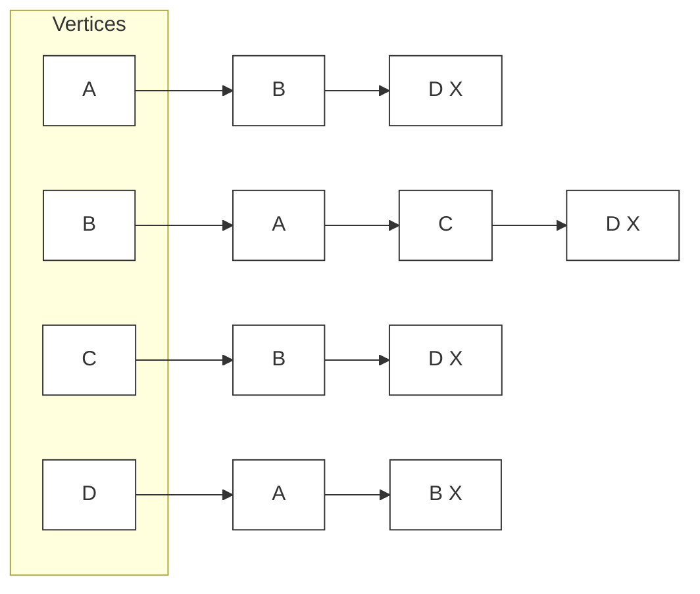
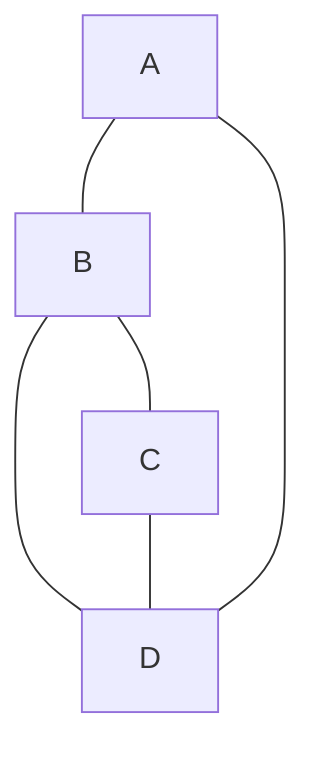

# My Adjacency List

```mermaid
graph LR
    subgraph Array [Vertices]
        direction TB
        A_root[A]
        B_root[B]
        C_root[C]
        D_root[D]
    end

    A_root --> A1[B] --> A2[D X]
    B_root --> B1[A] --> B2[C] --> B3[D X]
    C_root --> C1[B] -->C2[D X]
    D_root --> D1[A] --> D2[B X]

    classDef nodeStyle fill:#fff,stroke:#333,shape:rect
    class A_root,B_root,C_root,D_root,A1,A2,B1,B2,C1,D1,D2,C2,B3 nodeStyle
```

```mermaid
flowchart TD
   A --- B
   B --- D
   B --- C
   C --- D
   D --- A

```