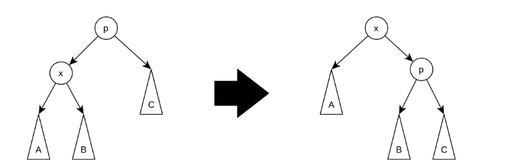
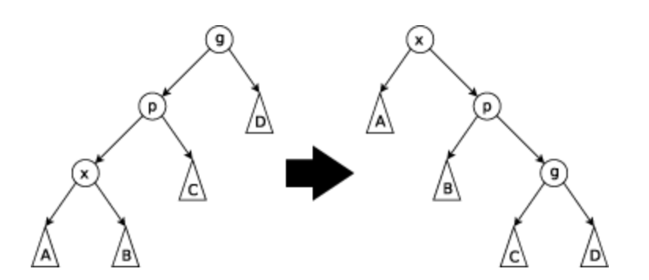
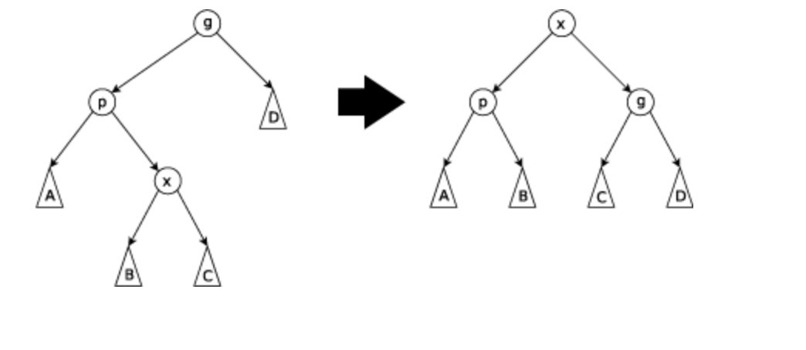

# splay tree

Invented in 1985 by Daniel Dominic Sleator 

* A splay tree allows for recently accessed elements to be accessed again

* All operations in a splay tree are combined with an operation called splaying 

* Splaying places the recently accessed node as the root of the tree

* This can be done at the same time as the operation or just done after the operation is completed

## Advantage:

A splay tree is self optimizing because it places the nodes that are frequently used closer to the root of the tree this makes the time complexity an average of O(log n) and O(n) at worst but that is rare.
Splay trees also don’t need to store much extra data so they take up less storage than some other types of trees.

## Disadvantages:

The disadvantaged of splay trees is that they can get very tall if you add/find items in a non decreasing order.

The trees can also change even in a read only tree because when finding elements it changes the order

## insertion 

    inserting just involves inserting in to the tree like a binary search tree and then running a splay operation on the inserted node.

## Splaying 

    splaying will move the added or accessed node (X) into the root but they way it does it changes based off where X is. 

    if the parent is the root then X becomes the root and gives the right child to the Parent. (Zig step)

    if the parent and X are not the root and X and P are same size children. X becomes the the root and gives the right child to Parent and the whole tree switches sides. (Zig-zig step)

    if the parent and X are not the root and the parent and X are different side children. If X is a right child and P is a left child. X gives Parent a left child and gives the parent of the parent the right child and becomes the root.

[visualizations](https://www.cs.usfca.edu/~galles/visualization/SplayTree.html)